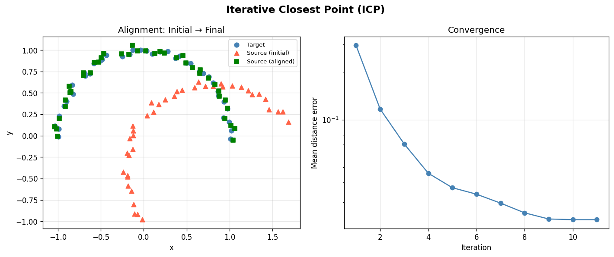
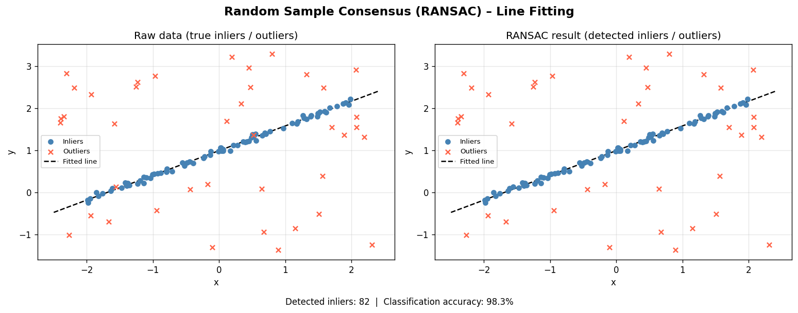
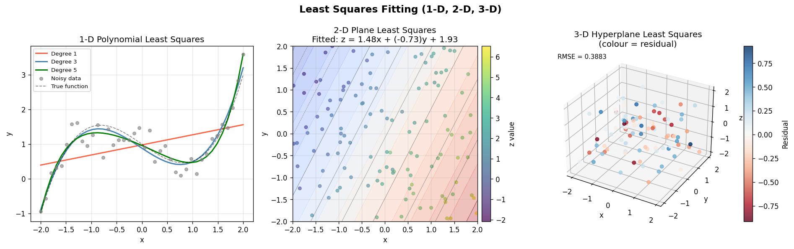
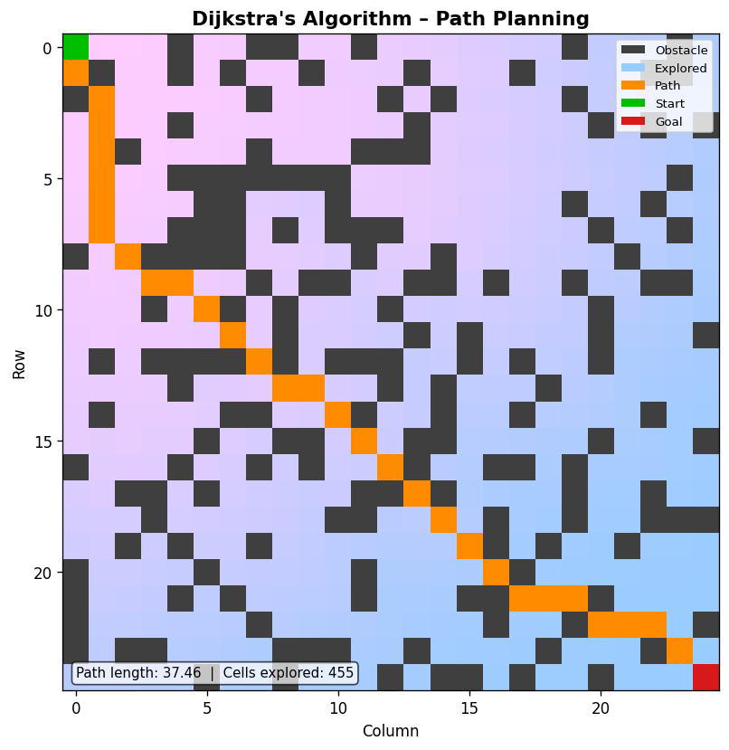
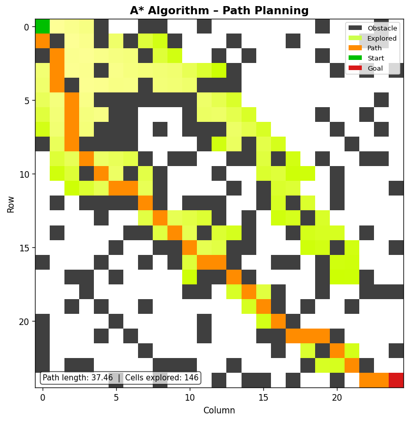
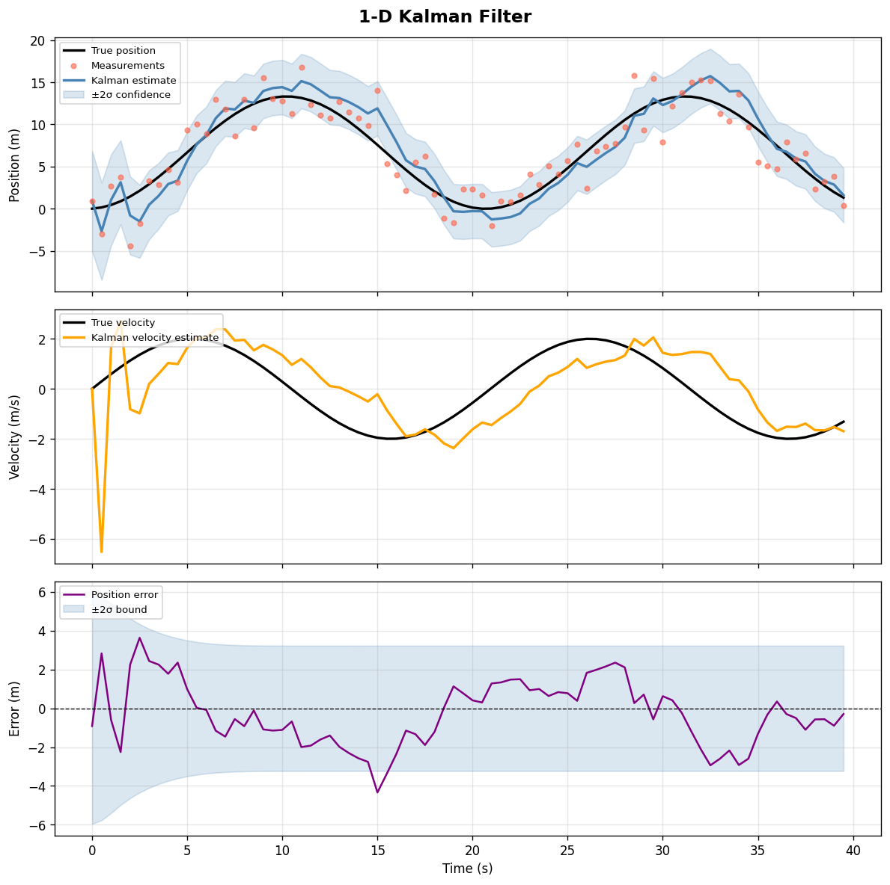

# mobile_robotics_visualizations

Python visualizations for common algorithms used in mobile robotics.  
Each module is self-contained: run it directly with `python <file>.py` and a
matplotlib window (plus a saved PNG) will appear.

---

## Visualizations

### Iterative Closest Point (ICP)
**`icp/icp.py`**

Aligns two 2-D point clouds by iteratively finding the best rotation and
translation that minimises the sum of distances between nearest-neighbour
pairs.  A convergence plot shows how the mean distance error decreases over
iterations.



### Random Sample Consensus (RANSAC)
**`ransac/ransac.py`**

Robust 2-D line fitting in the presence of outliers.  RANSAC repeatedly
samples random minimal subsets, counts inliers within a distance threshold,
and keeps the best model.  The final model is re-fitted using all detected
inliers.



### Least Squares Fitting (1-D, 2-D, 3-D)
**`least_squares/least_squares.py`**

Demonstrates ordinary least-squares regression at three levels of complexity:

| Case | Model | Plot |
|------|-------|------|
| 1-D | Polynomial curve fitting (degrees 1, 3, 5) | x–y scatter with fitted curves |
| 2-D | Plane fitting `z = ax + by + c` | 2-D contour overlay on scatter |
| 3-D | Hyperplane fitting `w = ax + by + cz + d` | 3-D scatter coloured by residual |



### Path Planning – A\* and Dijkstra
**`path_planning/astar.py`** · **`path_planning/dijkstra.py`**

Both algorithms find the shortest path on a randomly generated 25×25 occupancy
grid (8-connected, diagonal moves cost √2).  Running both on the same grid
makes it easy to compare the number of cells explored:

| Algorithm | Path length | Cells explored |
|-----------|-------------|----------------|
| Dijkstra  | 37.46       | 455            |
| A\*       | 37.46       | 146            |

A\* reaches the goal faster by using the Euclidean distance heuristic to focus
the search towards the goal.




### Kalman Filter (1-D)
**`kalman_filter/kalman_filter.py`**

Tracks a 1-D object with sinusoidally varying velocity using a linear Kalman
filter (state: position + velocity; measurement: position only).  Three panels
show the estimated vs. true position (with ±2σ confidence band), estimated vs.
true velocity, and the estimation error over time.



---

## Requirements

```
numpy
matplotlib
```

Install with:

```bash
pip install numpy matplotlib
```

## Running

```bash
python icp/icp.py
python ransac/ransac.py
python least_squares/least_squares.py
python path_planning/dijkstra.py
python path_planning/astar.py
python kalman_filter/kalman_filter.py
```

